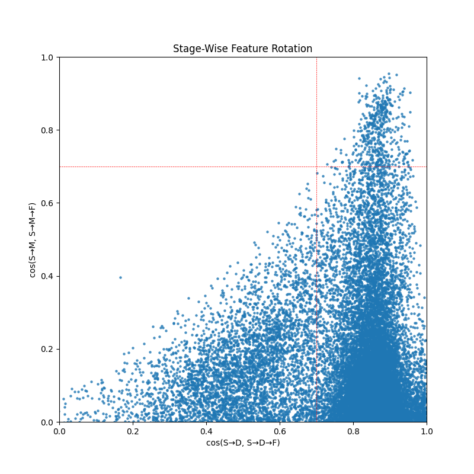
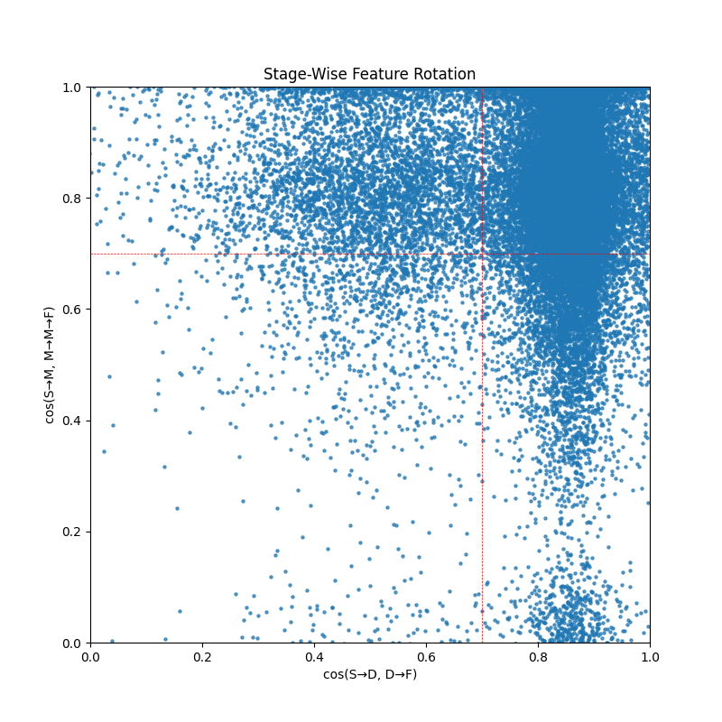

# base - chat model diffing (the format difference)

Hypothesis:
1. Base model and chat model diffs on unique tokens like `|<im_start>|`, `system` , etc.
2. Base model can generate responses in chat format by using the sae features to do steering, since I consider chat format is kind of in context learning.

(https://github.com/TheWayLost/base-chat-model-diffing)

### Generally, about five hours spend on reading:

1. https://www.alignmentforum.org/posts/fmwk6qxrpW8d4jvbd/saes-usually-transfer-between-base-and-chat-models

2. https://transformer-circuits.pub/2024/model-diffing/index.html

3. https://transformer-circuits.pub/2024/crosscoders/index.html

4. https://arxiv.org/pdf/2401.05566
（sleeper agent）

5. https://arxiv.org/pdf/2411.02193
（sae-ts， sae guided steering vector）

### First, six hours of trials and failures

(Actually, I spend lots of time on trying to use saelens properly, as its code for finetuning a pretrained sae is a little bit confusing to understand.)

I use `qwen1.5-0.5b` and `qwen-1.5-0.5b-chat` as the objects of model diffing. And the chat dataset 
is tokenized (`Lanzo-T-H/tokenized_alpaca_qwen1.5-parquet`, uploaded to huggingface) from `tatsu-lab/alpaca`. The pretrained dataset is `monology/pile-uncopyrighted` (untokenized).

At first, I use `base-chat.py`, `it-rand.py`, `it-chat-1.py`, `it-chat-2.py` to reproduce the sae_sd/sm/df/mf in the
model diffing paper. The logs and files are on wandb ( https://wandb.ai/3233822097-peking-university/sae_lens_tutorial/?nw=nwuser3233822097 ). All the SAEs are topK architecture.

However, the result two-stage comparison figure is:

After approximately 1.5 hours, I realized : this might be caused by using a wrong sae_sm by mistake. (Though I should have a throughly check on what happened since this figure is also quite interesting, I would do this next week.)
So I directly use the qwen-sae-base-finetuned in `saes-usually-transfer-between-base-and-chat-models` as my sae_sm. After another round of finetuning, the results becomes quite reasonable now:

### Analysis of the features

the `result/max10.txt` shows the top 10 features that have a minimum sum of `cos_similarity_smf + cos_similarity_sdf` and their corresponding max activation's contexts.

the `result/max10for2.txt` shows the input context with the top 10 highest activations of the most relevant two features I found (32232 and 19345). This is evaluated on the chat model `qwen1.5-0.5b-chat`. We can easily found that 32232 feature is highly relevant with the `.` before `|<im_end>|` in the system prompt (when there is only system prompt and no user input). The 19345 feature is activated on the `\n` token between `|<im_end>|` in the system instruction and `|<im_start>|` in the user input.

the `result/basemax10for2.txt` shows the same features, but evaluated on the base model `qwen1.5-0.5b`. It is interesting that both 32232 feature and 19345 feature activate on the same place: the `|<im_start>|` token at the beginning of the text.

See the files for detailed examples.

(Since the ddl is 3/7 now, I spent another 1 hour checking more results). Remember the difference between sae_mf and sae_sd? Since sae_sd is exactly the sae model finetuned based on base model and chat data, using sae_sd to analyze corresponding features would be more helpful. And I also provides more max_activations examples for more features. See files in the `base` and `chat` in the Github Repo for the full results. I selected the 50 features that are most severely rotated.

Here are some interesting insights:

For sae_sd and base model, these 2 most important features (32232, 13945) is hard to interpret. However, the sae_mf and chat model make these 2 features (and some other in these 50 features) quite clear as relevant to the {system,user,assistant} structure, for example, feature 3949 and 7032 mainly activate on <|im_end|>.

And 6581 feature is quite different, in the base model case, it sometimes activates on <|im_end|>, but the chat model turns it into a feature that mainly activates when the system prompt is to classify something. I suppose this might be caused by the unique distribution of my chat data.

### Summary

It take me another two hours trying to understand what this strange phenomenon means, and by looking into more activation examples, I only comes up with a merely okay explanation: my hypothesis 1 is true but the main difference is **base model fails to capture the {system,user,assistant} structure** since its corresponding feature mainly focus on the begining `|<im_start>|`.

Sadly, 15 hours passes really quickly and I do not have time for examining the hypothesis 2.

### Further

1.  When I get some spare time (maybe 3/25), I think it could be really interesting to play with these two features (such as, what will happen if I steer the chat / base model with them).

2.  Only using the activation of the response of chat data to tune the sae should be more proper and helpful.

3.  What about the first strange figure? What kind of mistake I made?

4.  If the normal steering fails, the method in https://arxiv.org/pdf/2411.02193 may help. And the technique in https://www.lesswrong.com/posts/jGuXSZgv6qfdhMCuJ/refusal-in-llms-is-mediated-by-a-single-direction may also help some.

